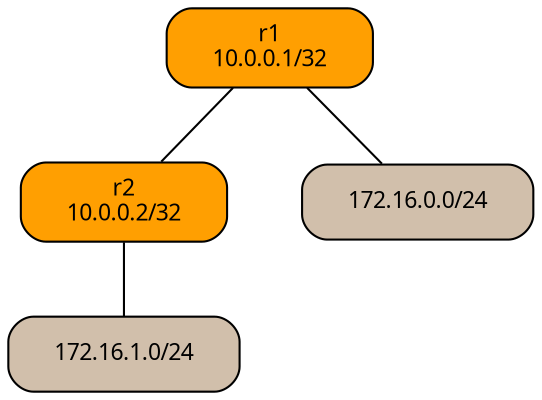

# NetLab Tutorial: Setting Up and Running a Simple OSPF Lab with FRR

This tutorial guides you through installing [netlab](https://netlab.tools/), a network simulation tool for automating virtual network labs. We'll use it to deploy a simple OSPF lab with two FRR (Free Range Routing) routers, based on the [netlab GitHub example](https://netlab.tools/example/github/#tutorial-github). This expands the original tutorial by including detailed prerequisites, verification steps, troubleshooting tips, and cleanup instructions. The lab demonstrates basic OSPF routing between two routers (`r1` and `r2`) with stub networks.

NetworkLab is a platform for creating and managing virtual network environments, using [Containerlab](https://containerlab.dev/) with Docker to quickly deploy and test network topologies. With Ansible integration, users automate device provisioning and configuration, ensuring efficient, repeatable setups for simulation, education, and network design.

It is highly recommended that you become familiar with clab, Docker, and Ansible to gain the full benefits of netlab and also to be able to troubleshoot any problems that may arise while creating netlab environmnets.

## Prerequisites

- **OS**: Ubuntu 22.04 LTS (tested in a Vagrant box; works on similar Debian-based systems).
- **Hardware**: At least 4GB RAM and 2 CPU cores (for the lab containers).
- **Git**: For cloning repos (optional, but recommended):
  ```
  sudo apt install git -y
  ```

```
    - **Virtualization**: Docker (for Containerlab). Install if needed:
    ```
    sudo apt update
    sudo apt install docker.io -y
    sudo systemctl start docker
    sudo systemctl enable docker
    sudo usermod -aG docker $USER  # Log out and back in for group changes
    ```
```

## Step 1: Install NetLab

NetLab is a Python-based tool. Install Python 3 and pip first, then netlab.

1. Update packages and install Python 3 pip (this pulls in build essentials and dependencies like GCC):
   ```
   sudo apt update
   sudo apt install python3-pip -y
   pip install networklab
   netlab version
   netlab version 25.07
   ```

2. Install the required tools such as containerlab and ansible. You can install them separately, but Netlab makes it easier to do it directly through the netlab command.

    ```
    $ netlab install
    ┏━━━━━━━━━━━━━━┳━━━━━━━━━━━━━━━━━━━━━━━━━━━━━━━━━━━━━━━━━━━━━━━━━━━┓
    ┃ Script       ┃ Installs                                          ┃
    ┡━━━━━━━━━━━━━━╇━━━━━━━━━━━━━━━━━━━━━━━━━━━━━━━━━━━━━━━━━━━━━━━━━━━┩
    │ ubuntu       │ Mandatory and nice-to have Debian/Ubuntu packages │
    │ libvirt      │ QEMU, KVM, libvirt, and Vagrant                   │
    │ containerlab │ Docker and containerlab                           │
    │ ansible      │ Ansible and prerequisite Python libraries         │
    │ grpc         │ GRPC libraries and Nokia GRPC Ansible collection  │
    └──────────────┴───────────────────────────────────────────────────┘
    ```

    Install each tool and verify the installation before proceeding.

    ```
    netlab install ubuntu
    ```

    ```
    netlab install ansible
    ansible --version
    ```

    ```
    netlab install containerlab
    clab version
    ...
    ```

## Step 2: Prepare the Lab Topology

Create a directory for your lab and define the topology in YAML.

1. Create and navigate to the lab directory:
   ```
   mkdir ~/nlab_ospf_frr
   cd ~/nlab_ospf_frr
   ```

2. Create `topology.yml` that defines the network topology with the following content (this defines two FRR routers with OSPF):
   ```yaml
    ---
    provider: clab
    defaults.device: frr
    module: [ ospf ]

    nodes: [ r1, r2 ]
    links: [ r1, r2, r1-r2 ]
   ```

## Step 3: Deploy the Lab

NetLab generates configs, deploys containers, and applies initial OSPF configs.

1. Start the lab:

   To start the lab, execute the command:

   ```
   netlab up
   ```

    The command **netlab up** creates *clab.yml* (containerlab configuration file), and Ansible inventory and variables files, starts the devices with **containerlab deploy** command, and configures the devices with **netlab initial** and **netlab create** commands.

2. Verify the network deployment:

    ```
    sudo clab inspect clab.yml  # List running containers and IPs
    ```

## Step 4: Interact with the Lab

Once devices are running, connect to devices and verify OSPF.

1. Connect to `r1`:
   ```
   netlab connect r1
   ```
   
   This drops you into bash on the container. Use `vtysh` for FRR CLI.

2. In the container (vtysh mode):
   ```
   vtysh
   show interface brief  # Check interfaces (eth1 stub up, eth2 P2P up, lo up)
   show ip route         # Verify OSPF routes (e.g., O 10.0.0.2/32 via 10.1.0.2)
   show ip ospf neighbor # Check OSPF adjacency (should show r2 as Full/DR)
   exit  # Exit vtysh
   exit  # Exit container
   ```

## Step 5: Cleanup

Stop and remove the lab.

1. Stop the lab (keeps files):
   ```
   netlab down
   ```

2. Full cleanup (removes containers, networks, and generated files):
   ```
   netlab down --cleanup
   ```
   - Removes `clab.yml`, `clab_files/`, `hosts.yml`, etc. Only `topology.yml` remains.

## Next Steps and Expansion Ideas

- **Scale the Lab**: Add more routers in `topology.yml` (e.g., `r3: { links: - r1: 10.2.0.1/30 }`).
- **Add BGP**: Include `module: [ospf, bgp]` and define ASNs.
- **Custom Configs**: Add `config: |` in `topology.yml` for manual FRR commands.
- **Automation**: Integrate with GitHub Actions for CI/CD labs.
- **Troubleshooting Logs**: Check `netlab.snapshot.yml` for transformed topology; use `netlab validate topology.yml` for errors.



# References

- https://www.packetswitch.co.uk/netlab-the-fastest-way-to-build-network-labs/
